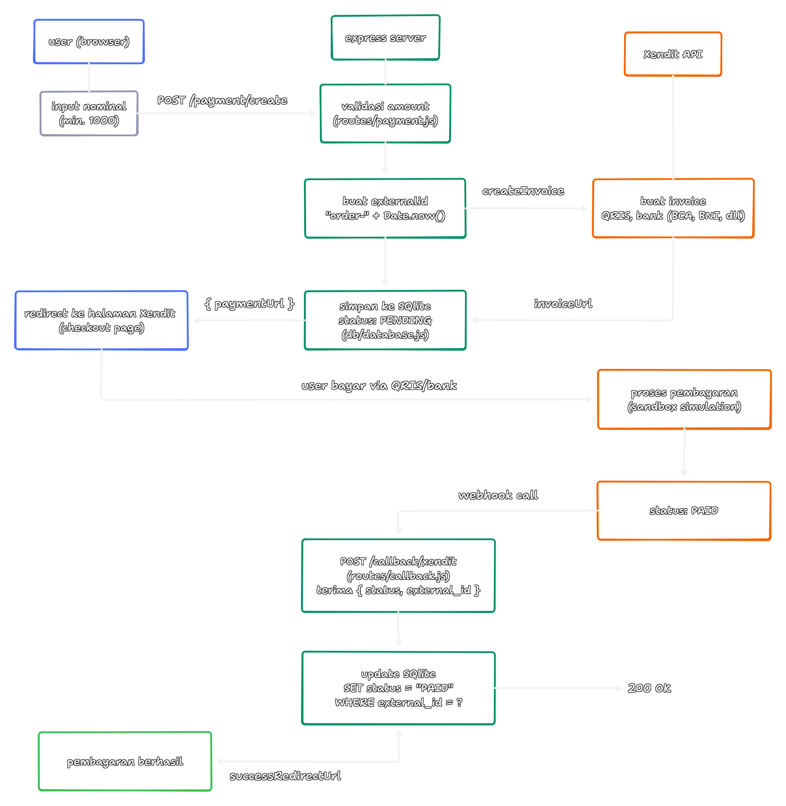
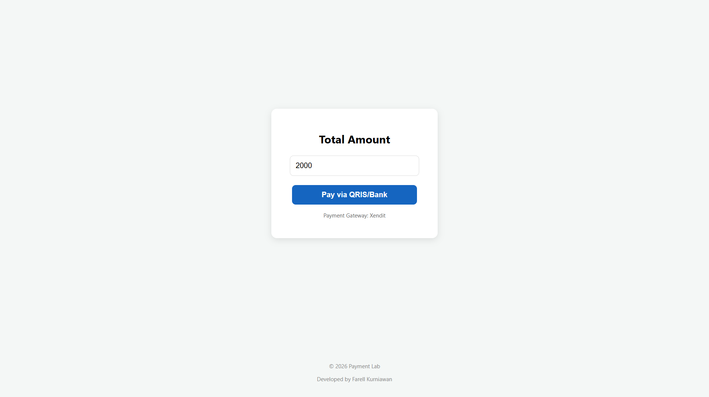
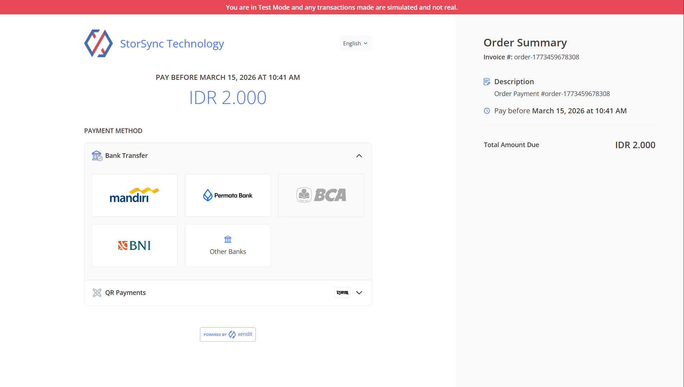
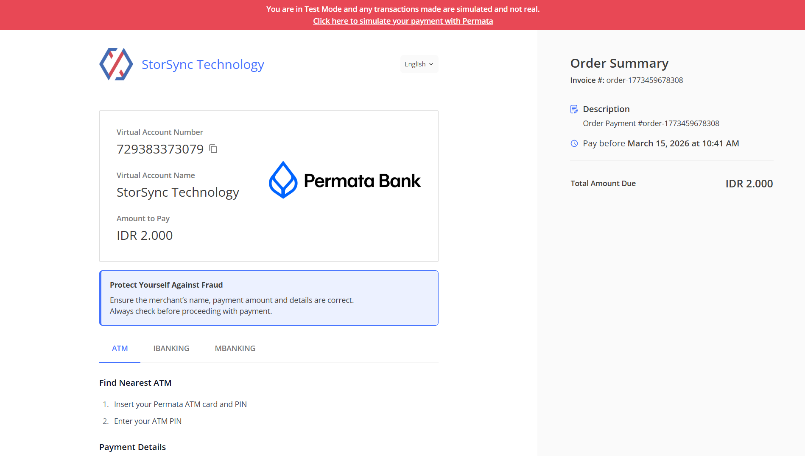
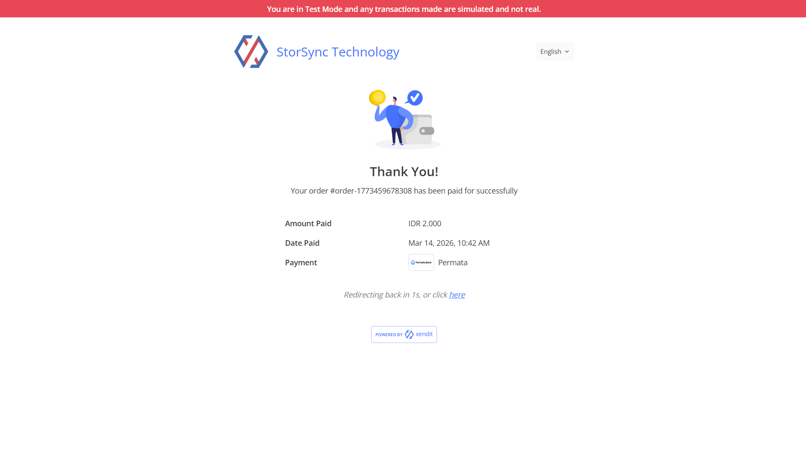
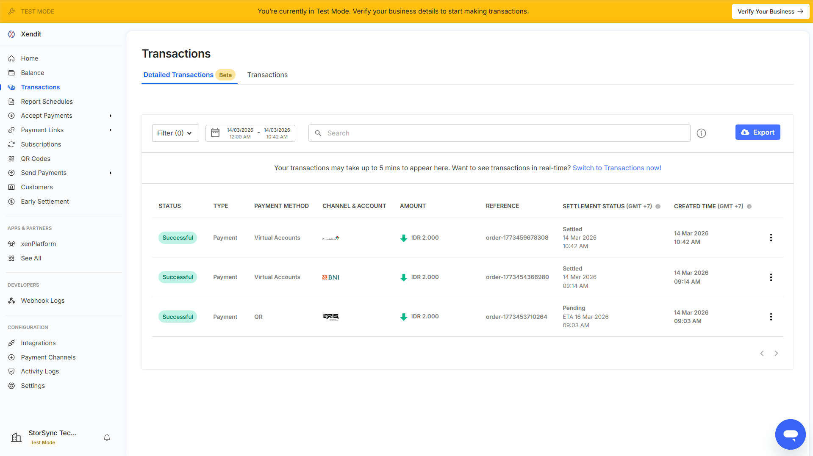

# Xendit: Payment Gateway Integration (Prototype)

This project is a technical exploration and prototype of payment gateway integration using **Xendit**. It originated from my personal interest in learning how secure, automated payment systems work within modern platforms and services.

> **Note:** This repository is a **prototype/simulation**. All transactions are conducted in the Xendit Sandbox environment for exploratory purposes. No real money is involved.

---

## Payment Flow



---

## Purpose
The main goal of this project is to understand the end-to-end flow of digital payments, specifically:
- Integrating with RESTful Payment APIs.
- Generating Dynamic QRIS and Invoices.
- Handling asynchronous payment notifications via Webhooks (Callbacks).
- Managing transaction states in a local database.

---

## Tech Stack
- **Backend:** Node.js, Express.js
- **Database:** SQLite
- **API:** Xendit Node.js SDK
- **Frontend:** HTML, CSS, JavaScript

---

## Features
- **Dynamic Payment Generation:** Automatically creates unique invoices with QRIS and Virtual Account options.
- **Simulation Flow:** Supports Xendit's "Simulate Payment" feature to test successful transaction handling.
- **Automated Webhook:** A dedicated endpoint to receive payment status updates and update the database automatically.
- **Responsive UI:** A clean, minimal checkout page for a better user experience.

---

## Installation & Setup

1. **Clone the repository:**
   ```bash
   git clone https://github.com/FKfarell17108/xendit-payment-prototype.git
   cd xendit-payment-prototype
   ```

2. **Install Dependencies:**
   ```bash
   npm install
   ```

3. **Environment Configuration:**
   
   Create a .env file in the root directory and add your Xendit Secret Key:
   ```bash
   XENDIT_SECRET_KEY=your_xendit_test_key_here
   PORT=3000
   ```

5. **Run the Server:**
   ```bash
   npm start
   ```
   The app will be available at `http://localhost:3000`.

---

## Documentation

<div align="center">
  
  
  
  
  
</div>

---

## © 2026 Farell Kurniawan

Copyright © 2026 Farell Kurniawan. All rights reserved.  
Distribution and use of this code is permitted under the terms of the **MIT** license.
